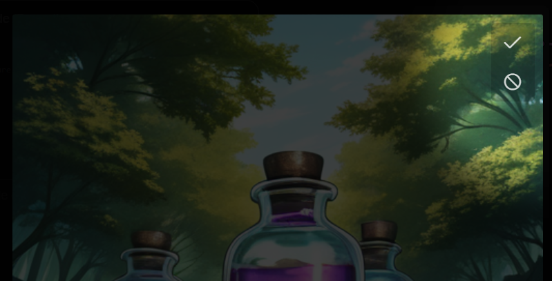

# ComfyUI-Liebs-Picker

A node to pause execution of the workflow and select which input images should proceed to the output. Pairs well with [ComfyUI-Liebs-Toast](https://github.com/marklieberman/ComfyUI-Liebs-Toast) to get a toast notification when the picker is available.

## Features

* Display a modal dialog with the images to select.
* Switch between a grid view and a single image view.
* **Pass images** selection mode to select desired images and send them through.
* **Filter images** selection mode to flag unwanted images and send remaining images.
* Modal can be operated with only keyboard (WASD or Arrow) or only mouse controls.
* Modal only displays in the browser tab that was running the workflow.
* Accepts images lists with different sized images. 
* Interactive SEGS label picker with clickable masks or bounding boxes when a mask is not available.

### Screenshots

| Screenshot | Description |
| :---- | :---- |
|  | The node accepts a batch of images and returns a filtered batch of images. When the node runs, execution will pause and an image picker dialog will be displayed.
|  | Images are displayed in a grid for selection. |
|  | Single image mode allows you to view each image using all available space. |
|  | **Pass images** mode is a positive selection where you pick specific images to pass through. **Filter images** mode is a negative selection where you pick specific images to discard. | 
|  | You can flag both wanted and unwanted images at the same time to help you process a large batch. |
|  | Hidden buttons appear when the mouse cursor hovers over the top-right of an image. |
|  | The modal behaviour and default selection mode are configurable. |
|  | Interactively label SEGS using a clickable overlay. |

## Controls

* Middle-click or Spacebar toggles between grid view and single image view.
* E, forward-slash /, or left-click to select or deselect images.
* X or single-quote ' to flag unwanted images.
* **Filter images** mode: the select action (E,/,click) is swapped with flag unwanted action (X,').
* Mouse-over the top-right of an image to reveal button controls.
* Enter to proceed with selection, or Escape to cancel workflow.
* Toggle SEGS overlay with Alt+`.
* Cycle individual SEG labels with left and right click or Alt+number keys.

### Grid view

* Arrows keys or WASD to nagivate between images in the grid view.
* Toggle selected images with number keys 1-9 and 0.

### Single image view

* Mouse-wheel, Left/Right arrow keys, or AD keys to navigate between images in single image view.

## Image Picker (SEGS)

See: [LiebsPickerSEGS.json](./docs/workflows/LiebsPickerSEGS.json) for an example workflow.

The SEGS image picker displays the given segments over the images in the picker. The masked area can be clicked to cycle through the labels provided by the segs_labels input.

An example workflow using the SEGS picker would: 
1. Perform detection using nodes from your preferred detector. ([ComfyUI-Impact-Pack](https://github.com/ltdrdata/ComfyUI-Impact-Pack), [comfyui_segment_anything](https://github.com/storyicon/comfyui_segment_anything), etc.) 
2. Optionally convert masks to SEGS using `MASK to SEGS` node and `SEGS Assign (label)` from ComfyUI-Impact-Pack.
1. Send generic labels like `face` and `body` into the picker.
2. Using the picker, assign specific labels wherever they belong. 
3. Extract the labelled segments using `SEGS Filter (label)` nodes.

| Label Segments | Filter Segments |
| :---- | :---- |
| Assign specific labels to detected segments to compose the image | Filter labels so that segments can be directed to detailers or other nodes. |
| <video src="https://github.com/user-attachments/assets/ef67d1cd-4968-479b-99ce-1a9de09d8e86" height="300px"> |  |

#### Node inputs:

| Input | Description |
| :---- | :---- |
| selection | `all`, `none`, or a comma-separated list of indexes to select. |
| locked | Locks the selection. Combine with selection `all` for a SEGS label only modal. |
| segs_labels | A comma-separated list of possible labels for SEGS in the images. |
| segs_label_mode | `any`, `matching_prefix` or `matching_suffix`. For example, in mode `matching_suffix` when `segs_labels`=`mean_body,nice_body,mean_face,nice_face` and the SEG has label `face` the possible labels for that SEG will be `mean_face,nice_face,face` |
| segs_on | Display SEGS when the modal opens, otherwise you have to toggle SEGS on. |

## Credits

This node was developed using the techniques from [cg-image-filter](https://github.com/chrisgoringe/cg-image-filter) by @chrisgoringe.

## Changelog

__1.2.0__

* Implemented the `Image Picker (SEGS)` node.

__1.1.1__

* Accept images lists with different sized images. ([#5](https://github.com/marklieberman/ComfyUI-Liebs-Picker/pull/5) by zopieux)

__1.1.0__

* Added **filter images** mode.

__1.0.0__

* Intial release
